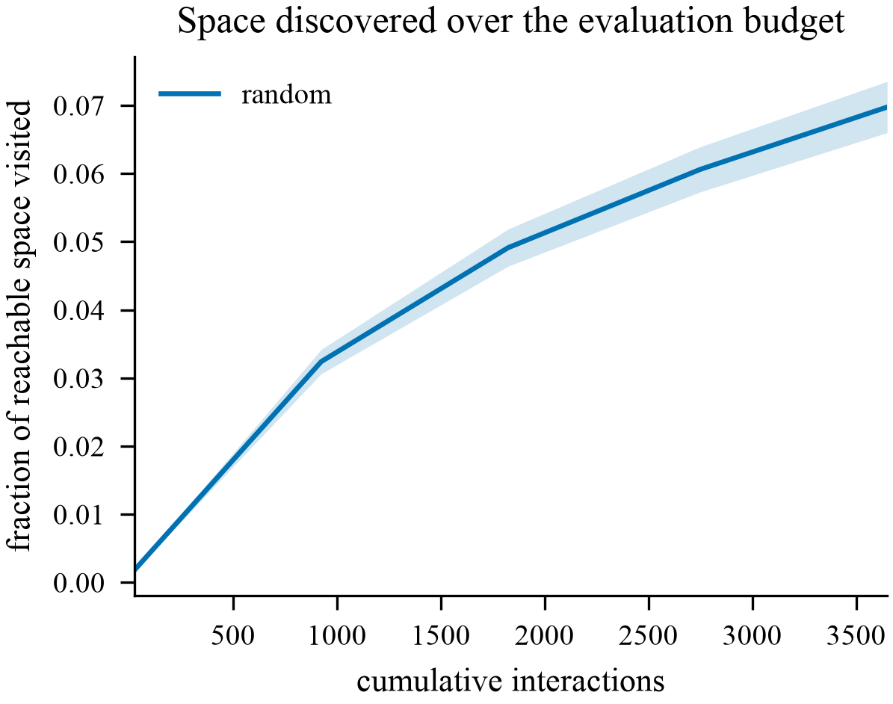
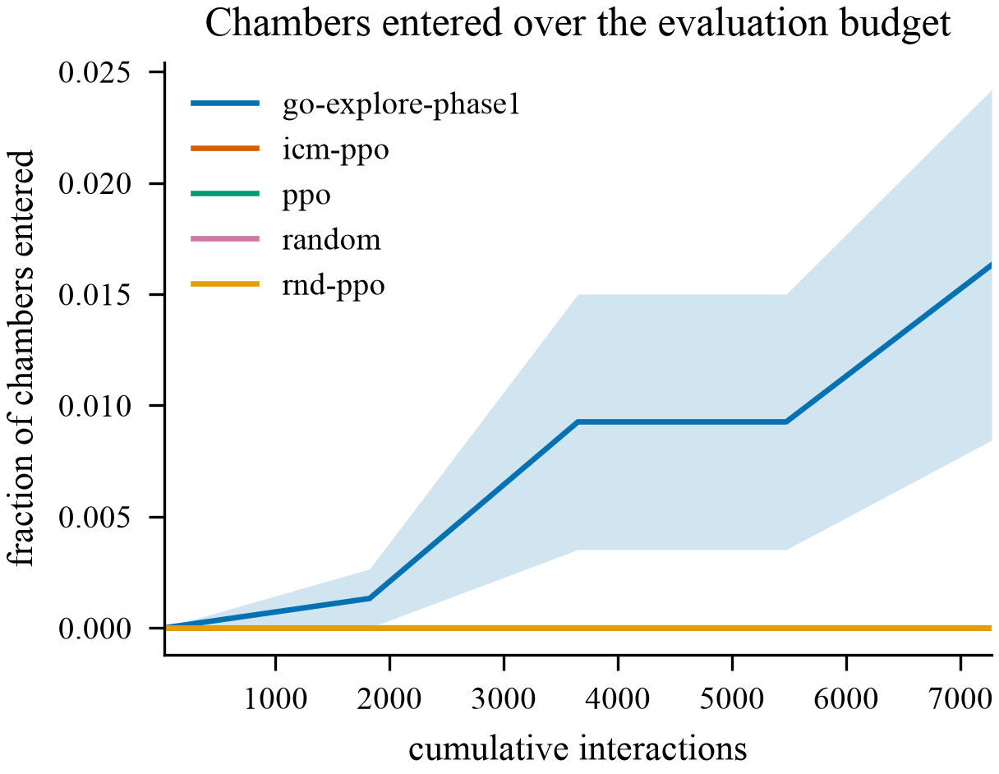
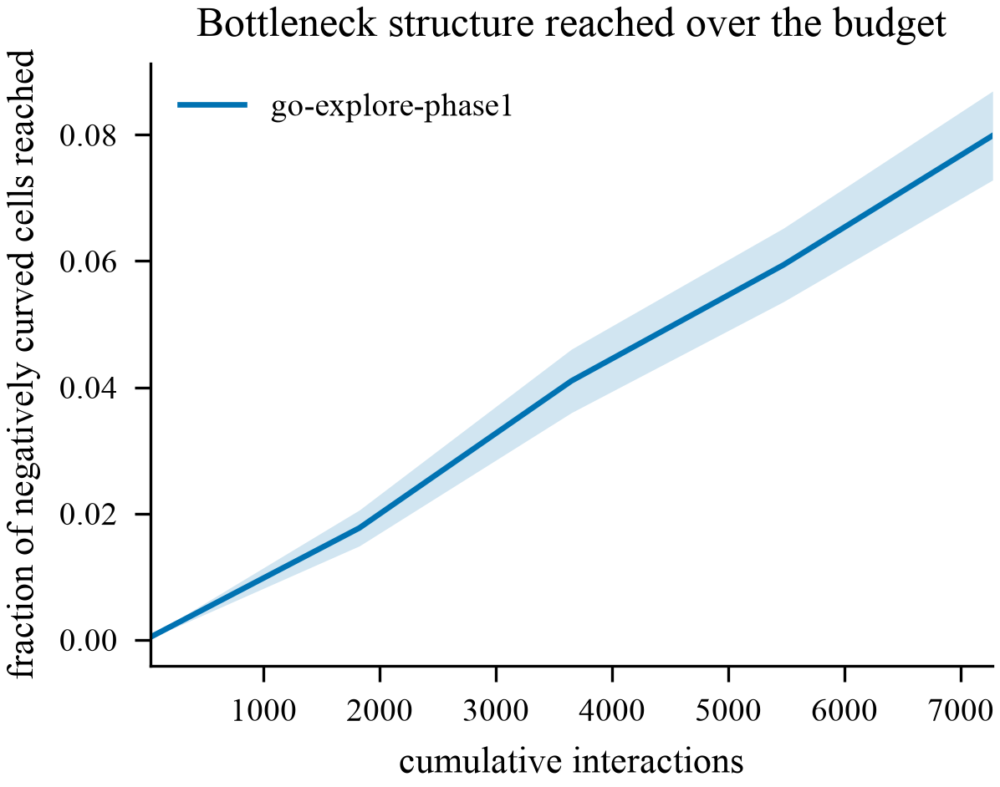
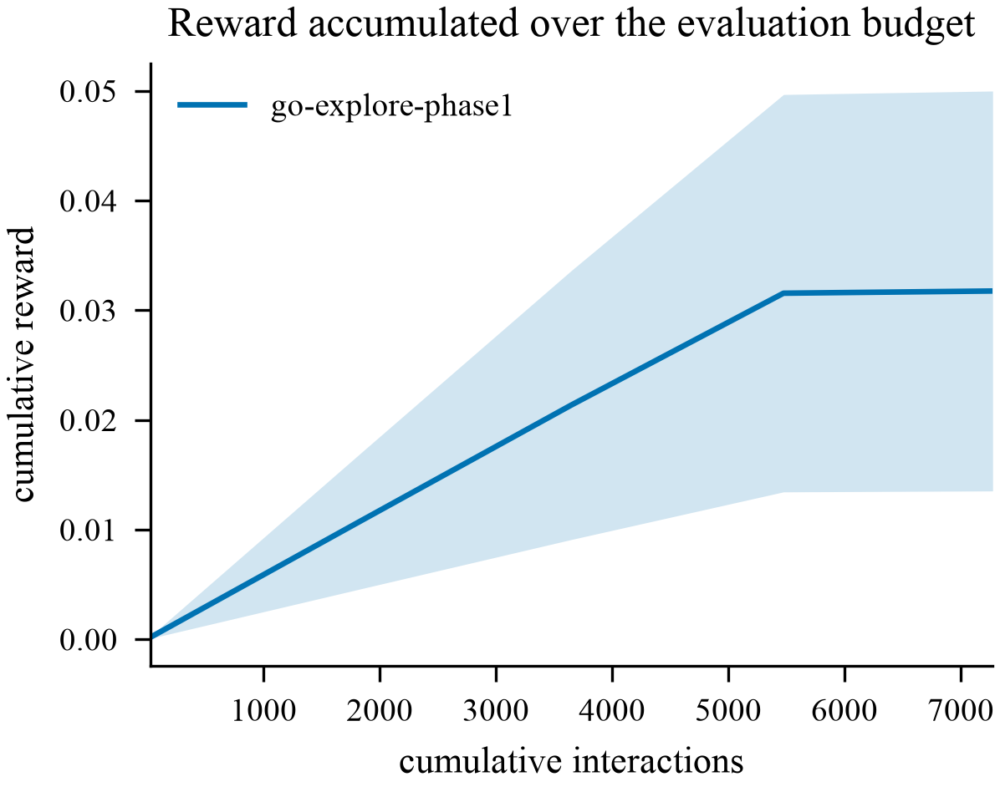
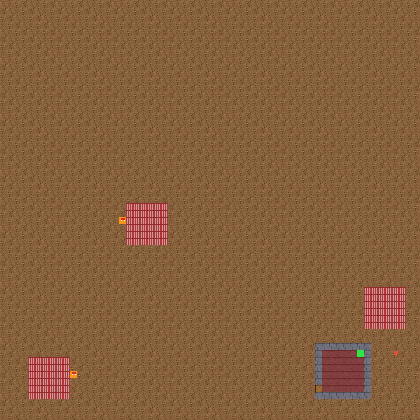
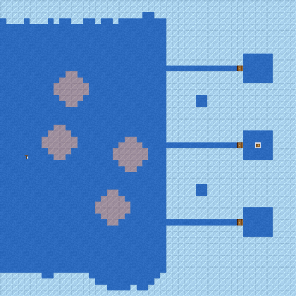
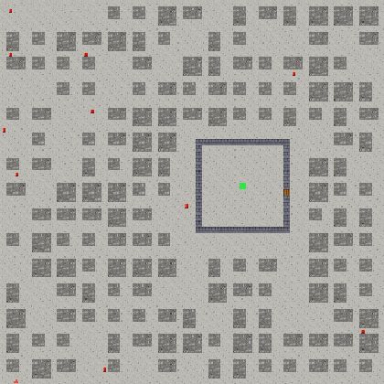
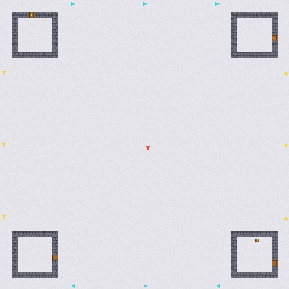
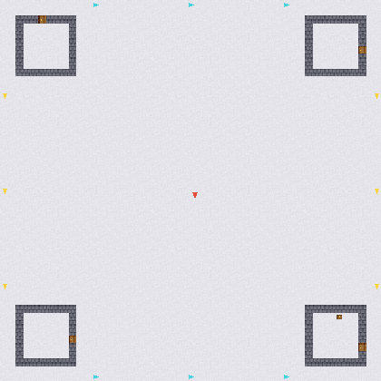

# TopoGym-v1 benchmark results

*Generated by `scripts/run_baselines_gridworld_v1_benchmark.py` — do not edit by hand.*

Every baseline follows one protocol: hyperparameters chosen on
`tune`, gradients taken on `train`, early stopping decided on
`val`, and `test` read once, at the end. Intervals are 95%
bootstrap confidence intervals over hold-out instances;
interquartile means come from
[rliable](https://github.com/google-research/rliable).

## Headline

| algorithm | success rate | median steps to goal [95% CI] | efficiency IQM [95% CI] | instances solved | mean coverage |
|---|---|---|---|---|---|
| `random` | 0.0% | — | 0.0 [0.0, 0.0] | 0/189 | 11.1% |

## Per slice

| algorithm | slice | instances | success rate | median steps to goal |
|---|---|---|---|---|
| `random` | GridWorld2D | 147 | 0.0% | — |
| `random` | Texture | 24 | 0.0% | — |
| `random` | Top | 18 | 0.0% | — |

## Discovery curves

### Space discovered over the evaluation budget

### Chambers entered over the evaluation budget

### Bottleneck structure reached over the budget

### Reward accumulated over the evaluation budget

## Training

| algorithm | iterations | why it stopped | best validation return | hyperparameters |
|---|---|---|---|---|
| `random` | 0 | budget exhausted | — | `—` (tuning inconclusive) |

## How each baseline explores

One hold-out instance per world, the same seed for every algorithm, so
the behaviours are directly comparable. An archive method's teleports
show up as jumps -- that is the mechanism, not a rendering glitch.

| world | `random` | `go-explore` |
|---|---|---|
| `BankRobber` |  |  |
| `ClownChase` |  |  |
| `DontFall` |  |  |
| `EnvironmentalIceShip` |  |  |
| `IceShip` |  |  |
| `Ladders` |  |  |
| `SearchRescue` |  |  |
| `SpaceWarp` |  |  |
| `TopRP2-50` |  |  |
| `TopTorus-50` |  |  |

## What is recorded

Each `benchmarks/results/<algorithm>.json` carries every
evaluated instance with the complete native metric set —
coverage milestones, visitation entropy, regret, planning
efficiency, curvature coverage, and (when the run enabled
`--track-topology`) the step at which each hole was first
seen — whether or not a figure plots it.
