# TopoGym

[](https://github.com/jcarlson212/TopoGym/actions/workflows/ci.yml)
[](LICENSE)
[](pyproject.toml)

**Gridworld environments and benchmarks for topological exploration in
reinforcement learning**, built on the [Gymnasium](https://gymnasium.farama.org)
API.

Every environment is generated on a real base manifold — a torus, a Möbius
band, a Klein bottle, RP², a sphere, a 3-torus — and carved with holes,
hidden chambers, and decoys that control its homology exactly. Every
environment ships with **certified topology metadata**: its Betti numbers
are *computed* from the actual free-space cubical complex at generation
time, not assumed.

<table>
<tr>
<td align="center">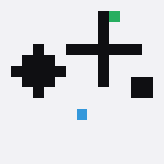<br><sub><b>square-holes</b></sub></td>
<td align="center">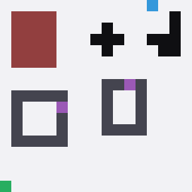<br><sub><b>square-rooms</b></sub></td>
<td align="center">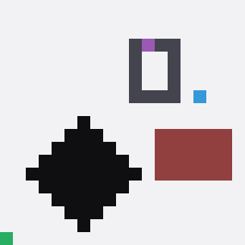<br><sub><b>annulus</b></sub></td>
<td align="center">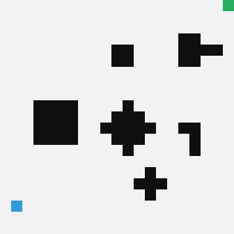<br><sub><b>plane-6holes</b></sub></td>
</tr>
<tr>
<td align="center">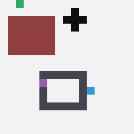<br><sub><b>cylinder-rooms</b></sub></td>
<td align="center">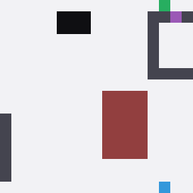<br><sub><b>mobius-rooms</b></sub></td>
<td align="center">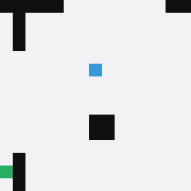<br><sub><b>torus-holes</b></sub></td>
<td align="center">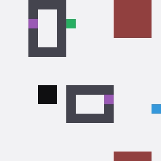<br><sub><b>torus-rooms</b></sub></td>
</tr>
<tr>
<td align="center">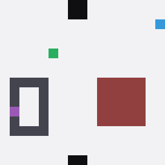<br><sub><b>klein-rooms</b></sub></td>
<td align="center">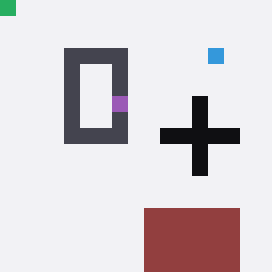<br><sub><b>rp2-rooms</b></sub></td>
<td align="center">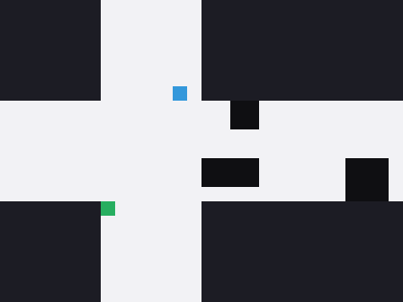<br><sub><b>sphere-holes</b></sub></td>
<td align="center">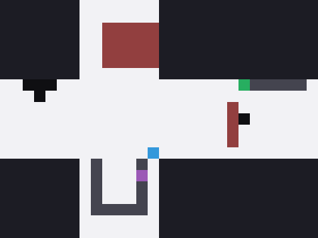<br><sub><b>sphere-rooms</b></sub></td>
</tr>
<tr>
<td align="center">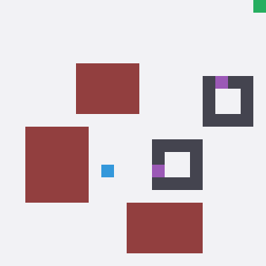<br><sub><b>square-decoyfield</b></sub></td>
<td align="center">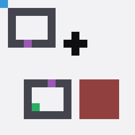<br><sub><b>torus-goal-in-chamber</b></sub></td>
<td align="center">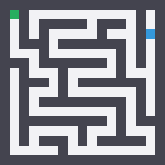<br><sub><b>control-maze</b></sub></td>
<td align="center"><br><sub><b>control-zigzag</b></sub></td>
</tr>
</table>

*The `2d_bench_grid_small` benchmark, rendered in reveal mode: walls (gray),
holes (black), hidden doors (purple — agents see walls until they bump
through), decoys (dark red — identical to chambers from outside, nothing
inside), start (blue), goal (green). The full gallery, including the 3D and
directed suites, is in [`docs/envs/`](docs/envs/README.md).*

## Why

Exploration methods increasingly claim to exploit the *shape* of an
environment — loops that shouldn't be re-searched, enclosed regions that
must be entered to be known, irreversible passages that deserve caution.
Testing those claims needs environments whose topology is **known, varied,
and controllable**:

- **Known**: every env carries certified Betti numbers (over ℤ/2, with
  integral homology and torsion where the math allows certification),
  Euler characteristic, orientability, genus, and a canonical description
  of any directional asymmetry.
- **Varied**: seven 2D base manifolds and four 3D ones, from a plain square
  to RP², all built from one gluing-spec abstraction you can extend.
- **Controllable**: a seeded generator that hits target Betti numbers and
  places chambers, decoys, hidden doors, one-way doors, and trapdoors —
  same config + same seed = byte-identical environment.

And because "my agent understands topology" must beat "my agent is good at
generic novelty-seeking", every benchmark includes **size-matched control
environments** that are hard to explore but topologically trivial.

## Install

```bash
# directly from GitHub (no clone needed):
pip install git+https://github.com/jcarlson212/TopoGym.git

# or for development:
git clone https://github.com/jcarlson212/TopoGym.git && cd TopoGym
pip install -e ".[testing]"
```

`pip install topogym` from PyPI lands with the first tagged release.
Dependencies: `gymnasium`, `numpy`. Nothing else.

## Quick start

```python
import gymnasium as gym
import topogym  # registers the TopoGym/* env ids

# A torus with 2 holes, a hidden chamber, and a decoy — fixed layout.
env = gym.make("TopoGym/Grid2D-v0", base="torus", size=17,
               n_holes=2, n_chambers=1, n_decoys=1, layout_seed=7)
obs, info = env.reset(seed=0)

print(info["topology"]["betti_z2"])     # [1, 5, 0] — certified
print(info["topology"]["genus"])        # 1
print(info["topology"]["homology"])     # {'H0': 'Z', 'H1': 'Z^5', 'H2': '0'}

obs, reward, terminated, truncated, info = env.step(2)  # forward
print(env.unwrapped.visited_betti())    # topology of the region seen so far
```

Or run a frozen benchmark:

```python
import topogym.benchmarks as bench

for entry in bench.get_benchmark("2d_bench_grid_small"):
    env = entry.make()
    obs, info = env.reset(seed=0)
    print(f"{entry.name:24s} b={info['topology']['betti_z2']}")

rows = bench.benchmark_metadata("2d_bench_grid_small")  # dicts, pandas-ready
```

More in [`examples/`](examples/).

## Environments

**`TopoGym/Grid2D-v0`** — an egocentric agent on a 2D base manifold.
Actions `Discrete(3)`: turn left / turn right / forward. The agent carries
a local frame that is parallel-transported as it moves: crossing a
Möbius/Klein/RP² seam **mirrors its view** (non-orientability is
experienced, not just declared), and walking a loop around a cube-sphere
corner rotates it by 90° (curvature). Observations are egocentric
`(2r+1, 2r+1)` patches, occluded by walls — chamber interiors must be
discovered, and decoys are visually identical to chambers until you try
every wall.

**`TopoGym/Grid3D-v0`** — a free agent in a 3D base manifold. Actions
`Discrete(6)`: moves along ±x/±y/±z. Observations are centered, occluded
`(2r+1)³` patches.

Both support `obs_mode="global"` (full grid + agent channel, for debugging
or fully-observable baselines), `reward_mode="goal"` (MiniGrid-style
success reward) or `"none"` (reward-free exploration), procedural layouts
(a new layout every `reset`) or pinned ones (`layout_seed=...`).

### Doors and asymmetric traversability

| mechanic | observed as | behavior |
|---|---|---|
| **hidden door** (`bump`) | wall, until opened | opens permanently after `tries` bumps — persistence is rewarded |
| **one-way door** | valve (visible) | enterable from exactly one side, forever |
| **trapdoor** | trapdoor (visible) | passable once; seals the moment you step off it |

Room features built from these: **chambers** (hidden interiors behind bump
doors), **decoys** (chamber look-alikes with nothing inside), **trap rooms**
(one-way in — an absorbing region), **airlocks** (one-way in, one-way out —
a directed circuit that stays strongly connected), and **trapdoor rooms**
(the way in seals; a hidden escape hatch leads out).

Door state never changes the free space's homology — a door cell is a free
cell either way. Doors gate *coverage* and *reversibility*, and that is
exactly what the metadata separates: Betti numbers describe the undirected
shape; the `asymmetry` block describes the directed dynamics.

### Bridges and the observed region

**Partitions** divide the world with narrow passages: dumbbells (one gap),
passage pairs (two gaps close a loop: b₁ + 1), hidden bridges (bump-door
gaps), on any base — a meridian wall on a torus makes closing the loop
require the wraparound. Partitions come in two materials: **wall** (opaque)
and **moat** (a pit — blocks movement but *not sight*, so the far side is
visible before it is reachable).

Bridges are not a separate kind of topology. During exploration, every
passage discovery is exactly one of: **frontier growth** (far side
unknown), an **H₀ merge** (two known regions join), or an **H₁ birth** (a
loop closure between already-connected regions). The envs track the
*observed region* — everything seen and believed free — as a monotone
filtration: `info["known_components"]` and `info["h0_merges"]` are
maintained incrementally, and `env.observed_betti()` gives the full
picture (its b₁ jumps are loop closures). Hidden doors participate
naturally: a closed bump-door is believed to be a wall, so opening it *is*
the discovery event.

What the metadata certifies instead is **difficulty**: the `connectivity`
block reports graph bridges, articulation points, biconnected components,
and `max_bridge_split` (the largest "smaller side" any single bridge
separates) of the free-cell graph — how rare and late the homological
events will be under naive exploration.

## Base manifolds

Every 2D base except the sphere is one rectangular fundamental domain plus
a gluing rule per axis — that is the abstraction to extend if you want new
surfaces:

| base | gluing (x, y) | χ | orientable | genus | b(ℤ/2) | H₁ torsion |
|---|---|---|---|---|---|---|
| `square` | wall, wall | 1 | yes | 0 | (1, 0, 0) | — |
| `cylinder` | wrap, wall | 0 | yes | 0 | (1, 1, 0) | — |
| `torus` | wrap, wrap | 0 | yes | 1 | (1, 2, 1) | — |
| `mobius` | flip, wall | 0 | no | ✝1 | (1, 1, 0) | — |
| `klein` | flip, wrap | 0 | no | ✝2 | (1, 2, 1) | ℤ/2 |
| `rp2` | flip, flip | 1 | no | ✝1 | (1, 1, 1) | ℤ/2 |
| `sphere` | cube surface | 2 | yes | 0 | (1, 0, 1) | — |

✝ = demigenus (crosscap number). Note RP² and the Klein bottle: their
interesting H₁ is torsion, invisible to rational Betti numbers — which is
why TopoGym certifies homology over ℤ/2 and reports torsion explicitly.

3D bases: `box` (trivial), `solid_torus` (wrap one axis, b₁=1 — the 3D
annulus), `torus3` (wrap all axes, b₁=3), plus presets `annulus`,
`x_holes` (2D) and `shell` (3D, b₂=1) built from large intrinsic holes.

## The generator

```python
from topogym.generation import TopoGenConfig2D, generate_2d

cfg = TopoGenConfig2D(
    base="klein", size=19,
    n_holes=2, hole_shapes=("rect", "disc", "blob", "plus"), hole_size=(2, 4),
    n_chambers=2, n_decoys=1, door_tries=(2, 5),
    n_trap_rooms=0, n_airlocks=1,            # directed features
    # target_b1=7,                           # or: solve n_holes for me
)
layout = generate_2d(cfg, seed=42)           # deterministic
print(layout.metadata.betti_z2)              # computed AND verified
```

Placement works by parallel transport, so shapes wrap seams and cross
cube-sphere edges correctly; margins keep every obstacle's homology
contribution independent; the generator retries until the *computed*
homology matches the analytic expectation, then certifies it. Each
feature's contribution:

| feature | 2D | 3D |
|---|---|---|
| hole / blob | +1 b₁ | +1 b₂ |
| ring | — | +1 b₁, +1 b₂ |
| chamber / decoy / trap room | +1 b₁ | +1 b₂ |
| airlock / trapdoor room | +2 b₁ | +1 b₁, +1 b₂ |
| partition, K gaps (attached) | +(K−1) b₁ | +(K−1) b₁ |
| partition, K gaps (ring/belt) | +K b₁ | — |

## Certified metadata

`env.unwrapped.topology` (also in `info["topology"]` at reset, as a plain
dict) — designed to be swept over programmatically:

```python
{
  "dim": 2, "base_map": "torus", "size": [17, 17], "style": "rooms",
  "layout_seed": 7, "n_holes": 2, "n_chambers": 1, "n_decoys": 1,
  "door_tries": [3], "n_cells": 289, "n_free_cells": 243,
  "betti_z2": [1, 5, 0],            # certified: computed from the complex
  "euler_characteristic": -4,
  "orientable": true, "genus": 1, "demigenus": null,
  "n_boundary_components": 4,
  "betti_q": [1, 5, 0], "h1_torsion": [], "homology": {"H0": "Z", "H1": "Z^5", "H2": "0"},
  "asymmetry": {
    "is_symmetric": true, "mechanisms": [], "n_sccs": 1,
    "largest_scc_frac": 1.0, "n_absorbing_sccs": 0,
    "goal_in_start_scc": true, "n_consumable_transitions": 0,
    "feature_counts": {"trap_room": 0, "airlock": 0, "trapdoor_room": 0}
  },
  "connectivity": {
    "n_bridges": 0, "n_articulation_points": 0,
    "n_biconnected_components": 1, "max_bridge_split": 0
  },
  "n_partitions": 0,
  "certified": {"betti_z2": true, "betti_q": true, "h1_torsion": true,
                "asymmetry": true, "connectivity": true, "genus": true},
  "base": {"name": "torus", "orientable": true, "genus": 1, "...": "..."}
}
```

Certification levels: `betti_z2` and `asymmetry` (SCC condensation of the
actual directed transition graph) are always computed. `betti_q`, torsion,
genus/orientability are certified for all 2D environments (surface
classification) and obstacle-free 3D bases; 3D-with-obstacles reports
`betti_q_expected` instead and says so in `certified`.

## Benchmarks

| collection | envs | contents |
|---|---|---|
| `2d_bench_grid_small` | 16 | all 7 bases, holes/chambers/decoys, goal-in-chamber, 2 controls |
| `3d_bench_grid_small` | 8 | rings (b₁), voids (b₂), rooms, solid torus, 3-torus, shell, control |
| `2d_bench_grid_small_directed` | 8 | trap rooms, airlocks, trapdoor rooms on 4 bases |
| `3d_bench_grid_small_directed` | 4 | the same mechanics in 3D |
| `2d_bench_grid_small_bridges` | 8 | dumbbells, passage pairs, moats, hidden bridges, torus meridian, sphere belt |
| `3d_bench_grid_small_bridges` | 4 | tunnel dumbbells, tunnel pairs, hidden tunnels, solid-torus gate |

Each entry pins `(config, layout_seed)` — everyone runs byte-identical
environments — and is registered as a Gymnasium id
(`TopoGym/Bench2DSmall-torus-rooms-v0`, ...). Browse them all in the
[gallery](docs/envs/README.md).

**Suggested protocol** (we follow it in `examples/`): fix ≥5 agent seeds
per environment; report mean ± std; use reward-free mode with coverage /
`visited_betti()` curves for exploration claims (time-to-discover each
homology class is the interesting curve); report absorbing-region outcomes
in directed envs explicitly (an agent that dies in a trap room is a data
point, not a dropped run); always include the controls.

## Contributing 🤝

Contributions are very welcome — this project is designed to be built on:

- **Add an environment** (no code needed): design it with
  [`scripts/new_env.py`](scripts/new_env.py), iterate on seeds, submit the
  frozen entry. Full walkthrough:
  [docs/contributing_environments.md](docs/contributing_environments.md).
- **Add a base manifold, hole shape, or door mechanic**: the extension
  points are documented in the same guide; if the generator isn't general
  enough for your idea, generalize it and send that too.
- **Add benchmarks**: propose a collection (bigger sizes, new mechanic
  mixes) via a [new-environment issue](.github/ISSUE_TEMPLATE/new_environment.md).

See [CONTRIBUTING.md](CONTRIBUTING.md) for dev setup and the PR checklist.
All new topology must come with certified tests — the homology engine is
the referee.

## Roadmap

- Genus-g surfaces (polygon gluings beyond rectangles)
- Non-orientable 3D bases (frame transport in 3D)
- Persistent-homology observers / wrappers for visited-region analysis
- Vectorized generation, larger benchmark tiers (`*_medium`, `*_large`)
- Community benchmark collection

## Citation

If you use TopoGym in your research, please cite it (see also
[`CITATION.cff`](CITATION.cff)):

```bibtex
@software{carlson2026topogym,
  author  = {Carlson, Jason},
  title   = {TopoGym: Environments and Benchmarks for Topological
             Exploration in Reinforcement Learning},
  year    = {2026},
  url     = {https://github.com/jcarlson212/TopoGym},
  version = {0.1.0}
}
```

## License

[Apache 2.0](LICENSE).
