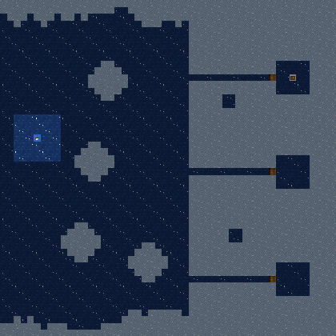
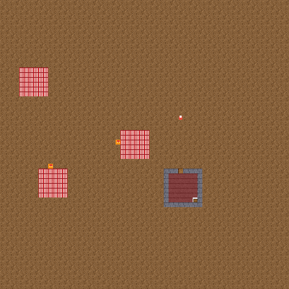
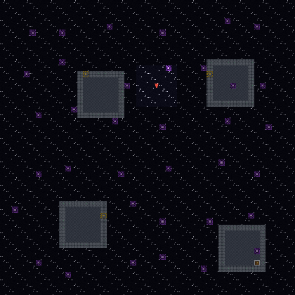
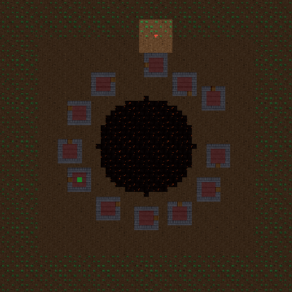
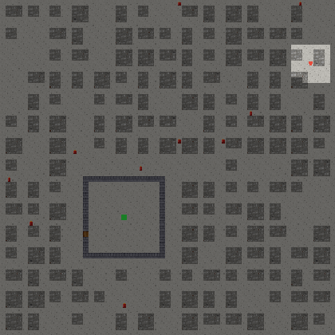
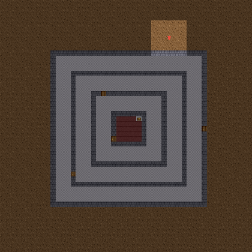
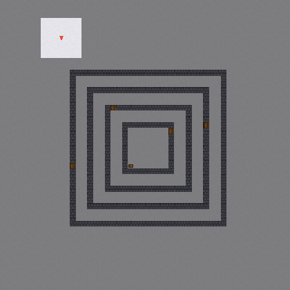
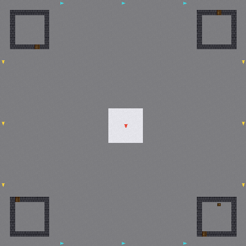

# TopoGym

[](https://github.com/jcarlson212/TopoGym/actions/workflows/ci.yml) [](https://pypi.org/project/topogym/) [](LICENSE) [](pyproject.toml) [](.pre-commit-config.yaml) [](https://github.com/astral-sh/ruff) [](https://discord.gg/2Sn6cTYbbw)

**Gridworld environments with certified topology, for exploration
research.**

TopoGym is a [Gymnasium](https://gymnasium.farama.org) environment
library where the *shape* of every world — its chambers, decoys, loops,
and identifications — is known exactly: computed from the free-space
cell complex by [GUDHI](https://gudhi.inria.fr/) and cross-checked
against the analytic expectation at generation time. Everything is
**deterministic up to seeds**, end to end.

<table>
<tr>
<td align="center"><br><sub><b>EnvironmentalIceShip</b></sub></td>
<td align="center"><br><sub><b>ClownChase</b></sub></td>
<td align="center"><br><sub><b>SpaceWarp</b></sub></td>
<td align="center"><br><sub><b>DontFall</b></sub></td>
</tr>
<tr>
<td align="center"><br><sub><b>SearchRescue</b></sub></td>
<td align="center"><br><sub><b>BankRobber</b></sub></td>
<td align="center"><br><sub><b>Nested3-50</b></sub></td>
<td align="center"><br><sub><b>TopTorus-50</b></sub></td>
</tr>
</table>

*Full gallery and per-environment documentation:
[`docs/envs/`](docs/envs/README.md) ·
[`docs/environments/`](docs/environments/README.md).*

## Why

Exploration methods increasingly claim to exploit environment
*structure*: enclosed regions that must be entered to be known, decoys
that punish persistence, loops that shouldn't be re-searched, reward
gradients that lie. Testing those claims needs environments whose
structure is **certified** (computed, not assumed), **controllable**
(same config + same seed = byte-identical world, across processes), and
**varied** along clean axes — world size, chamber count, decoy count,
shape, nesting, bottlenecks, texture, and global topology — with
size-matched controls that are hard to explore but topologically
trivial.

## Environments

One benchmark, **TopoGym-v1**, in three slices under a universal
interface (egocentric `Discrete(3)` turn-left / turn-right / forward
actions with an occluded egocentric view by default — the rendered
agent is a MiniGrid-style arrow, so its heading is always visible;
`actions="fourway"` opts into `Discrete(4)` screen-direction actions
with the universal `(x, y)` + 16-slot texture vector):

| slice | families | axis |
|---|---|---|
| **GridWorld2D** | `Dilution`, `Chambers2`, `ChamberCount`, `Decoys`, `Shape{Sq,Ci,Tr,St}`, `Nested`, `GiveUp`, `Bottleneck`, `Maze` | world size, chamber/decoy count, shape, nesting depth, corridor length, braiding |
| **Texture** | `IceShip`, `EnvironmentalIceShip`, `Ladders`, `BankRobber`, `DontFall`, `SpaceWarp`, `ClownChase`, `SearchRescue` | semantic local signals — and exactly where they fail |
| **Top** | `TopPlane`, `TopCylinder`, `TopMobius`, `TopTorus`, `TopKlein`, `TopRP2` | global topology with zero local signal |

Highlights: sealed **decoys** indistinguishable from chambers from the
outside; **DontFall**'s fatal drop where the most novel direction is
the worst one; **SpaceWarp**'s doorless treasure chamber, enterable
only through one wormhole in a field of thirty (noise for
gradient-followers, tractable for anything modeling transitions);
**ClownChase**'s wandering distractor paying a depleting trickle of
reward away from the treasure; **SearchRescue**'s trapped survivor in
the only large persistent hole of a shrapnel field; seasons in
**EnvironmentalIceShip**, where winter grows the ice until the channel
freezes shut around you; and Möbius/Klein/RP² worlds that are locally
flat everywhere — only globally aggregated signals (the identified
edges are drawn with fundamental-polygon arrows) can tell them apart.

Every id is stable: `gym.make("TopoGym/{Family}-{size}-v0", seed=n)`.
Details per family: [docs/environments/](docs/environments/README.md).

## Install

```bash
pip install topogym              # deps: gymnasium, numpy, gudhi
pip install "topogym[play]"      # + pygame, for keyboard play
```

Development: `git clone`, then `pip install -e ".[testing,play,assets]"`.

## Quick start

```python
import gymnasium as gym
import topogym  # registers the TopoGym/* ids

env = gym.make("TopoGym/Decoys4-50-v0", seed=3)
obs, info = env.reset(seed=0)
info["topology"]["betti_z2"]         # [1, 4, 0] — doors walkable
info["topology"]["betti_z2_sealed"]  # [2, 5, 0] — doors count as walls
```

Episodes truncate after a pre-determined horizon — the larger of
`1.2 * max(W, H)` and 3x the turn-aware optimal route, so the goal is
always reachable with room to wander; the
goal pays +1 terminal reward by default (`reward_mode="sparse"`) and
sits inside a designated chamber. `reward_mode="none"` for pure
exploration, `"coverage"`, `"deceptive"`; `goal=False` removes the goal;
`p_slip=0.1` for sticky-action noise; `complex="rips"` swaps the
homology backend to a Vietoris–Rips complex on the quotient metric.

Compose custom worlds with the fluent spec API:

```python
from topogym.spec import Torus

env = Torus(15).holes(3).chambers(1).compile(seed=7)
```

Measure what an agent actually discovered — from its own trajectory:

```python
from topogym.tda import ExplorationTracker
from topogym.stats import StatsRecorder

env = StatsRecorder(gym.make("TopoGym/Nested3-50-v0", seed=1))
tracker = ExplorationTracker(env)
tracker.reset(seed=0)
# ... run your policy ...
tracker.summary()      # discovery-time persistence: real vs transient loops
env.episodes           # per-episode rows: return, coverage, chamber entries
```

Archive-style (Go-Explore) resets are built in:

```python
env = gym.make("TopoGym/Maze-100-v0", seed=1, teleport=True)
env.reset(options={"teleport": (12, 40)})  # any previously visited cell
```

## Play any environment yourself

```bash
python scripts/play.py --list
python scripts/play.py TopoGym/SpaceWarp-v0
```

Arrow keys move; `Tab` reveals hidden structure; `r` resets;
`Backspace` regenerates the layout. Rendering dims everything outside
the agent's current line of sight (reveal mode shows all). Set
`TOPOGYM_DEBUG=1` to stream everything the env computes each step to
the console, and `TOPOGYM_OVERLAY=1` (alias `OVERLAY_ENABLED=1`) for
the live H1 overlay: every step, the known region's holes are drawn on
the grid — representative cycles in yellow, enclosed-wall rims in
green (a yellow cycle with no green rim is a transient belief), with a
legend and live H1 count top-right.

## Determinism, certification, and stats

- **Determinism up to seeds is a guarantee, not an accident**:
  (config, seed) fixes the layout and its metadata byte-for-byte —
  including everything computed through GUDHI — and (env, reset seed,
  actions) fixes the episode, `p_slip` included. Iteration orders are
  sorted so nothing depends on interpreter hash state; a cross-process
  test enforces it.
- **Certified metadata on every env** (`info["topology"]`): Betti
  numbers in both door conventions, Euler characteristic,
  orientability, genus, bottleneck descriptors, the full generator
  configuration, and the canonical config string
  (`TG-GridWorld2D-S50-C1-D4-...`) as the run-log key.
  `topogym.registry.manifest()` emits the validity manifest.
- **Stats built in**: `info` tracks within-episode coverage, lifetime
  (cross-episode) coverage, chamber entries, and return;
  `StatsRecorder` accumulates pandas-ready rows.

## Documentation

- **[`docs/specs/topo_gym_overview.pdf`](docs/specs/topo_gym_overview.pdf)**
  — the detailed environment specification: world model, registry,
  generator schema, modes, reward semantics, complex backends, and the
  Texture/Top constructions. The authority on the benchmark.
- [docs/environments/](docs/environments/README.md) — per-environment
  pages (spaces, rewards, registered configurations).
- [docs/reference.md](docs/reference.md) — library internals: the cell
  complex, the generator, TDA, the metrics interface, and
  `VisitedComplex` — the incremental visited-state topology structure
  (cubical / Vietoris–Rips / witness backends, F_p or Z coefficients,
  representative cycles) for building custom topological agents.
- [`croissant.json`](croissant.json) +
  [`docs/manifest.csv`](docs/manifest.csv) — MLCommons Croissant
  metadata over the pinned registry (one record per environment id
  with its canonical config and certified topology), auto-generated by
  `scripts/generate_croissant.py`.

## Contributing 🤝

- **Discord**: [join us](https://discord.gg/2Sn6cTYbbw).
- Add an environment without writing code:
  [`scripts/new_env.py`](scripts/new_env.py) — walkthrough in
  [docs/contributing_environments.md](docs/contributing_environments.md).
- Extend the framework (new families, shapes, mechanics):
  [CONTRIBUTING.md](CONTRIBUTING.md). All new topology ships with
  certified tests — the homology engine is the referee.

## Citation

If you use TopoGym in your research, please cite:

```bibtex
@software{carlson2026topogym,
  author  = {Carlson, Jason},
  title   = {TopoGym: Environments and Benchmarks for Topological
             Exploration in Reinforcement Learning},
  year    = {2026},
  url     = {https://github.com/jcarlson212/TopoGym},
  version = {0.1.0}
}
```

[MIT](LICENSE). See also [`CITATION.cff`](CITATION.cff).
