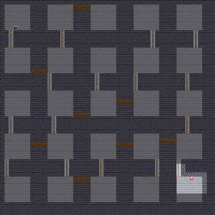

# Ladders

Platforms joined by ladders (vertical) and bridges (horizontal); the gem sits on the top platform.

## Action space

Egocentric `Discrete(3)` (default): 0 = turn left, 1 = turn right,
2 = step forward; the rendered agent (arrow or scenario sprite) always
points where it faces. `actions="fourway"` opts into `Discrete(4)`:
0 = up, 1 = down, 2 = left, 3 = right (screen directions). Moving into
an obstacle leaves the agent in place. With `p_slip > 0` the executed
action is resampled uniformly with that probability.

## Observation space

Default (egocentric): an occluded egocentric symbolic patch, agent
centered and facing up. `obs_mode="vector"` (default under fourway)
gives the universal vector observation: the agent's integer cell
coordinates `(x, y)` followed by a 16-slot texture block in `[0, 1]`
(slots 0-3: blocker adjacency left/right/above/below; 4-15:
per-scenario semantic features, zero outside the Texture variants);
`obs_mode="global"` the full symbolic grid.

## Rewards and episodes

`reward_mode="sparse"` (default): +1 terminal on reaching the goal.
Other modes: `none`, `coverage`, `deceptive`; `goal=False` removes the
goal entirely. Episodes truncate after a pre-determined `1.2 * max(W, H)`
steps (`max_steps` overrides). Layouts, metadata, and rollouts are
deterministic up to seeds.

## Registered configurations

| id | certified b(Z/2) |
|---|---|
| `TopoGym/Ladders-v0` | `[1, 0, 0]` |

Make with `gym.make(id, seed=n)`; the seed drives layout variation within the frozen configuration.
