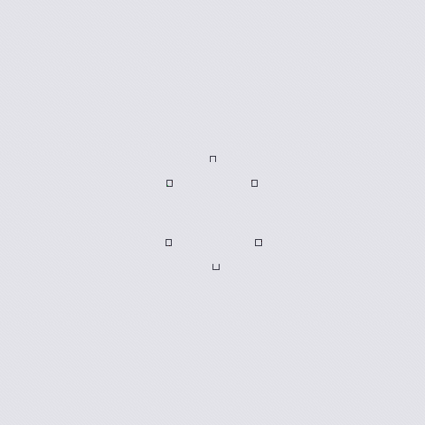

# OpenFieldChamberCount6-530

> **In no benchmark.** Breaks the property every rostered family holds: that the goal lies within one episode horizon L of the start, so a policy alone can reach it. Here the goal sits beyond L, so only a method that chains episodes through an archive can ever arrive, and a policy-only baseline scores zero by construction rather than by being bad. That makes these instruments for archival methods specifically -- niche, and without a roster home. OpenFieldChamberCount keeps EnlargedChamberCount's guaranteed door separation but moves the chambers off the world's perimeter onto a ring about the start, with open floor between that ring and the boundary. It exists because of a measurement: in EnlargedChamberCount every method is pinned against the wall by half its step budget, after which the boundary is a rail leading from one chamber to the next, so the score partly measures boundary sweeping. Here the wall is never reached and the only exploitable structure is the ring the agent has itself encircled.

## Action space

Egocentric `Discrete(3)` (default): 0 = turn left, 1 = turn right,
2 = step forward; the rendered agent (arrow or scenario sprite) always
points where it faces. `actions="fourway"` opts into `Discrete(4)`:
0 = up, 1 = down, 2 = left, 3 = right (screen directions). Moving into
an obstacle leaves the agent in place. With `p_slip > 0` the executed
action is resampled uniformly with that probability.

## Observation space

Default (egocentric): an occluded egocentric symbolic patch, agent
centered and facing up. `obs_mode="vector"` (default under fourway)
gives the universal vector observation: the agent's integer cell
coordinates `(x, y)` followed by a 16-slot texture block in `[0, 1]`
(slots 0-3: blocker adjacency left/right/above/below; 4-15:
per-scenario semantic features, zero outside the Texture variants);
`obs_mode="global"` the full symbolic grid.

## Rewards and episodes

`reward_mode="sparse"` (default): +1 terminal on reaching the goal.
Other modes: `none`, `coverage`, `deceptive`; `goal=False` removes the
goal entirely. Episodes truncate after a pre-determined `1.2 * max(W, H)`
steps (`max_steps` overrides). Layouts, metadata, and rollouts are
deterministic up to seeds.

This family pins its horizon at **60 steps** rather than deriving it from the layout: the budget is the premise, and the world is sized to fit it.

## Registered configurations

| id | certified b(Z/2) |
|---|---|
| `TopoGym/OpenFieldChamberCount6-530-v0` | `[1, 0, 0]` |

Make with `gym.make(id, seed=n)`; the seed drives layout variation within the frozen configuration.
