# Environment gallery

Rendered in *reveal* mode: hidden doors (purple), decoy fills
(dark red), start (blue), goal (green), one-way doors (yellow,
arrow = entry side), trapdoors (orange). Agents do not see any
of the revealed information.

## `2d_bench_grid_small`

| env | preview | certified topology |
|---|---|---|
| **square-holes** 3 holes on a disc: b1 = 3, nothing hidden |  | `b = [1, 3, 0]` |
| **square-rooms** holes + hidden chambers + a decoy |  | `b = [1, 5, 0]` |
| **square-decoyfield** many identical-looking rooms; most are empty decoys |  | `b = [1, 5, 0]` |
| **annulus** thick annulus base + one chamber and one decoy |  | `b = [1, 3, 0]` |
| **plane-6holes** plane with 6 large holes: b1 = 6 |  | `b = [1, 6, 0]` |
| **cylinder-rooms** cylinder: one loop is the world itself |  | `b = [1, 4, 0]` |
| **mobius-rooms** Mobius band: crossing the seam mirrors you |  | `b = [1, 4, 0]` |
| **torus-holes** torus with 2 holes: b1 = 3 |  | `b = [1, 3, 0]` |
| **torus-rooms** torus with chambers and a decoy |  | `b = [1, 5, 0]` |
| **torus-goal-in-chamber** the goal hides inside a chamber: doors must be found |  | `b = [1, 5, 0]` |
| **klein-rooms** Klein bottle: torus-like but non-orientable |  | `b = [1, 4, 0]` |
| **rp2-rooms** RP^2: the antipodal world |  | `b = [1, 3, 0]` |
| **sphere-holes** cube-sphere with 3 holes |  | `b = [1, 2, 0]` |
| **sphere-rooms** cube-sphere with chambers and a decoy |  | `b = [1, 2, 0]` |
| **control-maze** control: perfect maze, hard to explore, b1 = 0 |  | `b = [1, 0, 0]` |
| **control-zigzag** control: serpentine corridor, one long path, b1 = 0 |  | `b = [1, 0, 0]` |

## `2d_bench_grid_small_directed`

| env | preview | certified topology |
|---|---|---|
| **square-traproom** a one-way room: enter and you stay | 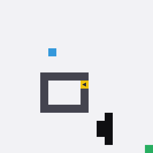 | `b = [1, 2, 0], SCCs = 2 (1 absorbing)` |
| **square-airlock** a directed circuit: in one door, out the other | 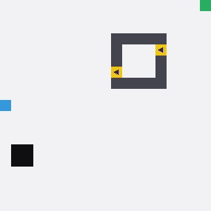 | `b = [1, 3, 0], SCCs = 1` |
| **square-trapdoor** a trapdoor room: the way in seals, a hidden hatch leads out | 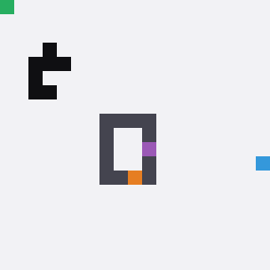 | `b = [1, 3, 0], SCCs = 1` |
| **cylinder-trapdoor** trapdoor room on a cylinder | 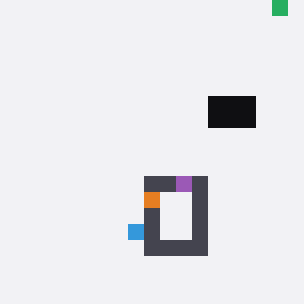 | `b = [1, 4, 0], SCCs = 1` |
| **torus-traproom** trap room on a torus | 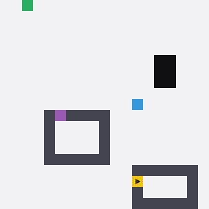 | `b = [1, 4, 0], SCCs = 2 (1 absorbing)` |
| **torus-airlock-mix** airlock + trapdoor room on a torus | 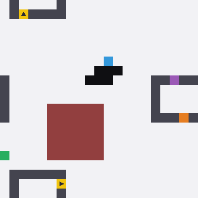 | `b = [1, 7, 0], SCCs = 1` |
| **sphere-traproom** trap room on the cube-sphere | 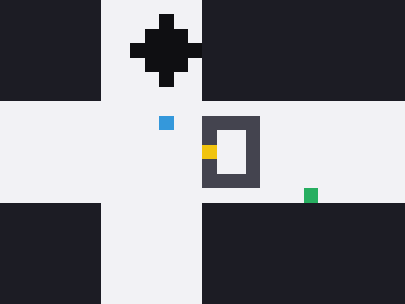 | `b = [1, 1, 0], SCCs = 2 (1 absorbing)` |
| **square-gauntlet** one of everything: trap room, airlock, trapdoor room, decoy | 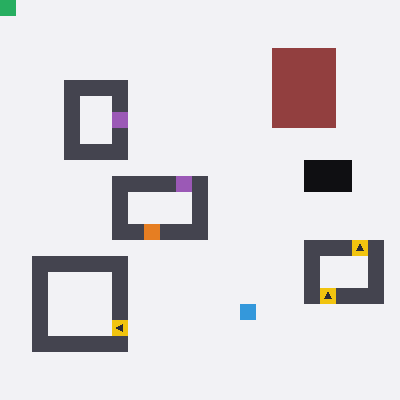 | `b = [1, 8, 0], SCCs = 2 (1 absorbing)` |

## `3d_bench_grid_small`

| env | preview | certified topology |
|---|---|---|
| **box-blobs** 2 solid obstacles: b2 = 2 enclosing shells | 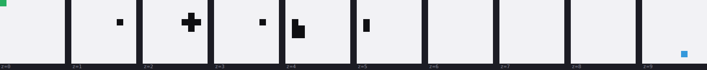 | `b = [1, 0, 2, 0]` |
| **box-ring** a ring obstacle: b1 = 1, b2 = 1 | 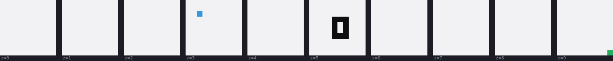 | `b = [1, 1, 1, 0]` |
| **box-rooms** a hollow chamber and a sealed decoy | 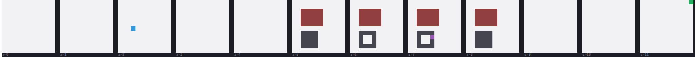 | `b = [1, 0, 2, 0]` |
| **box-mixed** ring + void + chamber | 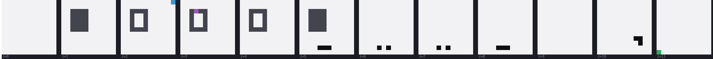 | `b = [1, 1, 3, 0]` |
| **solid-torus** solid torus: one loop is the world itself | 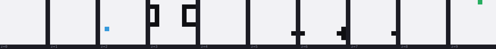 | `b = [1, 2, 2, 0]` |
| **torus3** 3-torus: wraps in every direction, b1 = 3 | 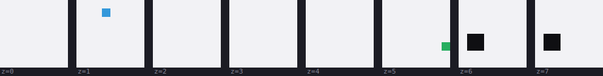 | `b = [1, 3, 3, 0]` |
| **shell** spherical shell: a big void you can never enter | 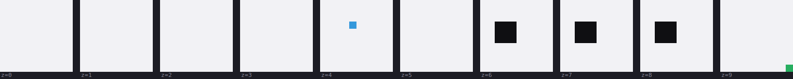 | `b = [1, 0, 1, 0]` |
| **control-maze3d** control: perfect 3D maze, b1 = b2 = 0 | 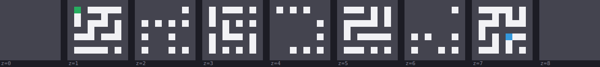 | `b = [1, 0, 0, 0]` |

## `2d_bench_grid_small_bridges`

| env | preview | certified topology |
|---|---|---|
| **square-dumbbell** two rooms, one narrow passage: b1 = 0, all bottleneck | 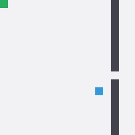 | `b = [1, 0, 0]` |
| **square-twin-passages** two passages through one wall: the loop closure env | 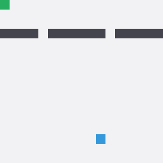 | `b = [1, 1, 0]` |
| **square-moat-hidden** a moat you can see across; one open bridge, one hidden | 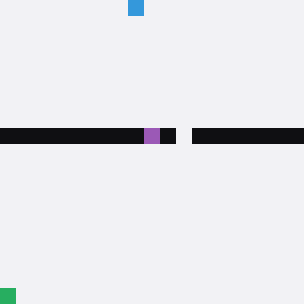 | `b = [1, 1, 0]` |
| **square-triple-rooms** two dividing walls, three regions | 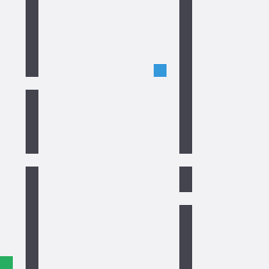 | `b = [1, 2, 0]` |
| **cylinder-ring-gate** a gate across the cylinder | 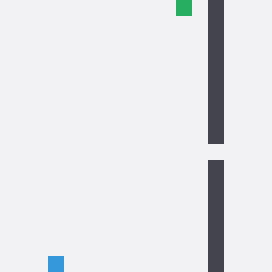 | `b = [1, 1, 0]` |
| **torus-meridian** a meridian wall on the torus: close the loop through the wrap | 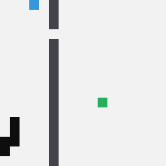 | `b = [1, 3, 0]` |
| **sphere-belt** an equatorial belt with two passages | 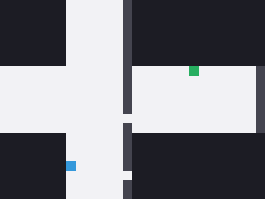 | `b = [1, 1, 0]` |
| **square-bridge-gauntlet** a moat with a hidden bridge, plus a chamber and a decoy | 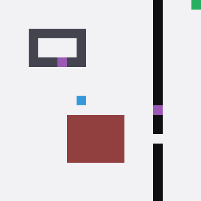 | `b = [1, 3, 0]` |

## `3d_bench_grid_small_bridges`

| env | preview | certified topology |
|---|---|---|
| **box-dumbbell** two chambers of space, one tunnel | 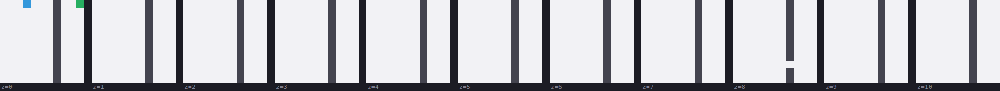 | `b = [1, 0, 0, 0]` |
| **box-two-tunnels** two tunnels through one wall: b1 = 1 | 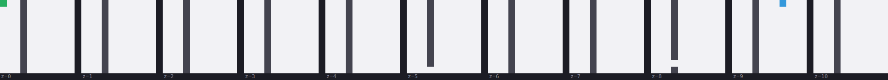 | `b = [1, 1, 0, 0]` |
| **box-hidden-tunnel** one tunnel open, one hidden | 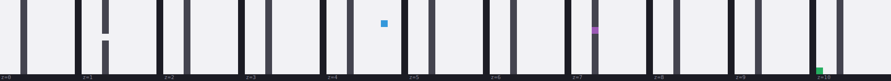 | `b = [1, 1, 0, 0]` |
| **solid-torus-gate** a gate disc across the solid torus: the wrap loop passes it | 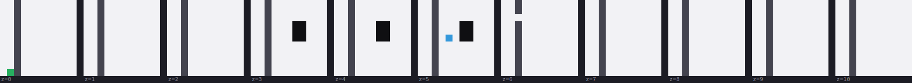 | `b = [1, 1, 1, 0]` |

## `3d_bench_grid_small_directed`

| env | preview | certified topology |
|---|---|---|
| **box-traproom** a one-way room in 3D | 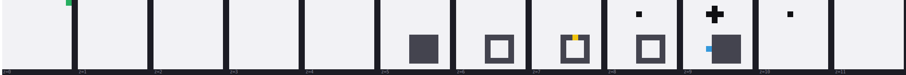 | `b = [1, 0, 2, 0], SCCs = 2 (1 absorbing)` |
| **box-airlock** a 3D airlock: directed circuit through a room | 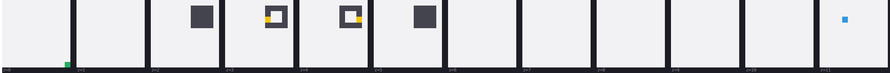 | `b = [1, 1, 1, 0], SCCs = 1` |
| **box-trapdoor** 3D trapdoor room with a hidden escape hatch | 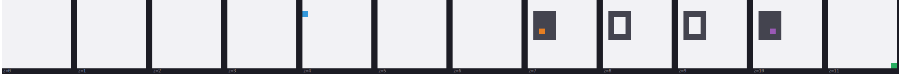 | `b = [1, 1, 1, 0], SCCs = 1` |
| **solid-torus-traproom** trap room in a solid torus | 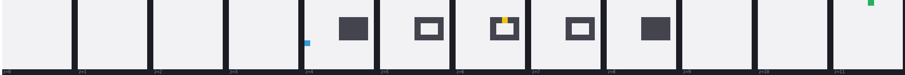 | `b = [1, 1, 1, 0], SCCs = 2 (1 absorbing)` |

