# Environment gallery

Reveal-mode stills (hidden doors purple, decoys dark red);
GIFs show a coverage explorer navigating. Regenerate with
`python scripts/generate_assets.py`.

| env | id | b(Z/2) | view |
|---|---|---|---|
| **Dilution-50** | `TopoGym/Dilution-50-v0` | `[1, 0, 0]` |  |
| **Dilution-200** | `TopoGym/Dilution-200-v0` | `[1, 0, 0]` |  |
| **Chambers2-50** | `TopoGym/Chambers2-50-v0` | `[1, 0, 0]` |  |
| **Chambers2-100** | `TopoGym/Chambers2-100-v0` | `[1, 0, 0]` |  |
| **Chambers2-200** | `TopoGym/Chambers2-200-v0` | `[1, 0, 0]` |  |
| **Chambers2-400** | `TopoGym/Chambers2-400-v0` | `[1, 0, 0]` |  |
| **ChamberCount1-200** | `TopoGym/ChamberCount1-200-v0` | `[1, 0, 0]` |  |
| **ChamberCount2-200** | `TopoGym/ChamberCount2-200-v0` | `[1, 0, 0]` |  |
| **ChamberCount4-200** | `TopoGym/ChamberCount4-200-v0` | `[1, 0, 0]` |  |
| **ChamberCount8-200** | `TopoGym/ChamberCount8-200-v0` | `[1, 0, 0]` |  |
| **EnlargedChamberCount2-60** | `TopoGym/EnlargedChamberCount2-60-v0` | `[1, 0, 0]` | 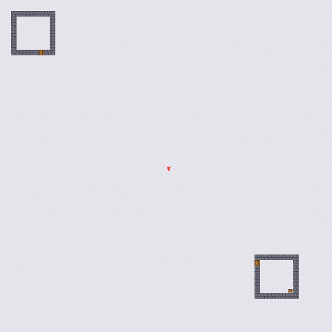 |
| **EnlargedChamberCount3-60** | `TopoGym/EnlargedChamberCount3-60-v0` | `[1, 0, 0]` |  |
| **EnlargedChamberCount4-80** | `TopoGym/EnlargedChamberCount4-80-v0` | `[1, 0, 0]` | 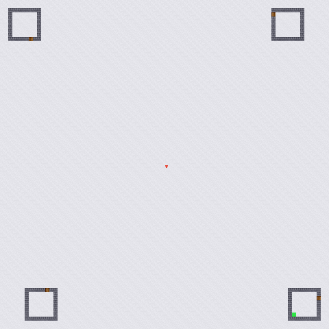 |
| **EnlargedChamberCount5-100** | `TopoGym/EnlargedChamberCount5-100-v0` | `[1, 0, 0]` |  |
| **EnlargedChamberCount6-120** | `TopoGym/EnlargedChamberCount6-120-v0` | `[1, 0, 0]` | 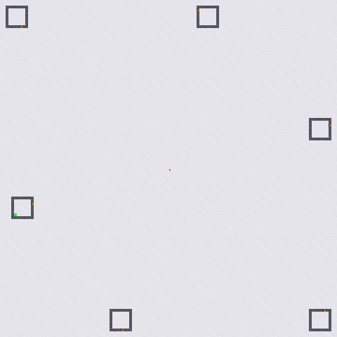 |
| **EnlargedChamberCount8-150** | `TopoGym/EnlargedChamberCount8-150-v0` | `[1, 0, 0]` |  |
| **EnlargedChamberCount10-180** | `TopoGym/EnlargedChamberCount10-180-v0` | `[1, 0, 0]` |  |
| **OpenFieldChamberCount2-480** | `TopoGym/OpenFieldChamberCount2-480-v0` | `[1, 0, 0]` | 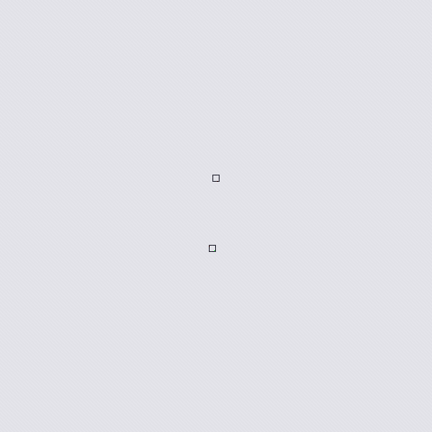 |
| **OpenFieldChamberCount3-490** | `TopoGym/OpenFieldChamberCount3-490-v0` | `[1, 0, 0]` |  |
| **OpenFieldChamberCount4-500** | `TopoGym/OpenFieldChamberCount4-500-v0` | `[1, 0, 0]` | 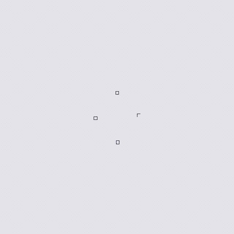 |
| **OpenFieldChamberCount5-510** | `TopoGym/OpenFieldChamberCount5-510-v0` | `[1, 0, 0]` |  |
| **OpenFieldChamberCount6-530** | `TopoGym/OpenFieldChamberCount6-530-v0` | `[1, 0, 0]` |  |
| **OpenFieldChamberCount8-570** | `TopoGym/OpenFieldChamberCount8-570-v0` | `[1, 0, 0]` | 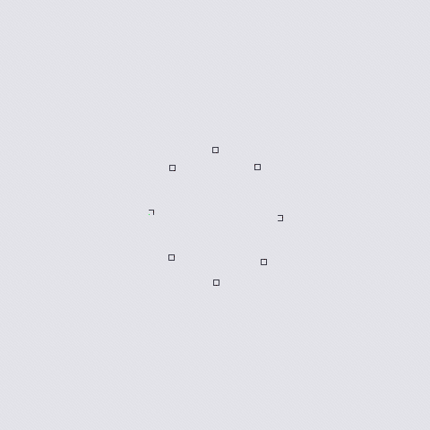 |
| **OpenFieldChamberCount10-610** | `TopoGym/OpenFieldChamberCount10-610-v0` | `[1, 0, 0]` | 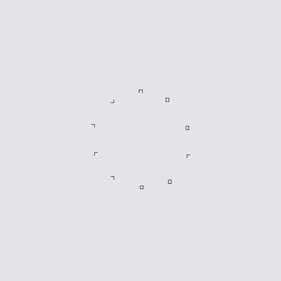 |
| **Decoys0-50** | `TopoGym/Decoys0-50-v0` | `[1, 0, 0]` |  |
| **Decoys1-50** | `TopoGym/Decoys1-50-v0` | `[1, 1, 0]` |  |
| **Decoys2-50** | `TopoGym/Decoys2-50-v0` | `[1, 2, 0]` |  |
| **Decoys4-50** | `TopoGym/Decoys4-50-v0` | `[1, 4, 0]` |  |
| **Decoys8-50** | `TopoGym/Decoys8-50-v0` | `[1, 8, 0]` |  |
| **ShapeSq-50** | `TopoGym/ShapeSq-50-v0` | `[1, 0, 0]` |  |
| **ShapeCi-50** | `TopoGym/ShapeCi-50-v0` | `[1, 0, 0]` |  |
| **ShapeTr-50** | `TopoGym/ShapeTr-50-v0` | `[1, 0, 0]` |  |
| **ShapeSt-50** | `TopoGym/ShapeSt-50-v0` | `[1, 0, 0]` |  |
| **Nested1-50** | `TopoGym/Nested1-50-v0` | `[1, 0, 0]` |  |
| **Nested2-50** | `TopoGym/Nested2-50-v0` | `[1, 0, 0]` |  |
| **Nested3-50** | `TopoGym/Nested3-50-v0` | `[1, 0, 0]` |  |
| **GiveUp1-50** | `TopoGym/GiveUp1-50-v0` | `[1, 0, 0]` |  |
| **GiveUp2-50** | `TopoGym/GiveUp2-50-v0` | `[1, 0, 0]` |  |
| **GiveUp4-50** | `TopoGym/GiveUp4-50-v0` | `[1, 0, 0]` |  |
| **Bottleneck3-100** | `TopoGym/Bottleneck3-100-v0` | `[1, 0, 0]` |  |
| **Bottleneck6-100** | `TopoGym/Bottleneck6-100-v0` | `[1, 0, 0]` |  |
| **Maze-50** | `TopoGym/Maze-50-v0` | `[1, 0, 0]` |  |
| **Maze-100** | `TopoGym/Maze-100-v0` | `[1, 0, 0]` |  |
| **EpicChase1-60** | `TopoGym/EpicChase1-60-v0` | `[1, 0, 0]` |  |
| **EpicChase2-70** | `TopoGym/EpicChase2-70-v0` | `[1, 0, 0]` |  |
| **EpicChase3-70** | `TopoGym/EpicChase3-70-v0` | `[1, 0, 0]` |  |
| **EpicChase4-90** | `TopoGym/EpicChase4-90-v0` | `[1, 0, 0]` | 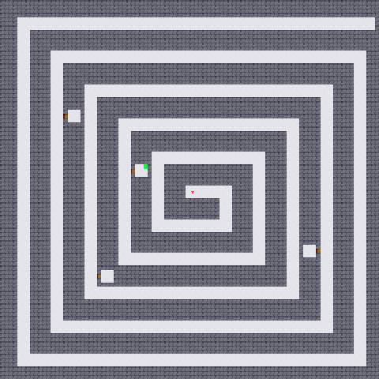 |
| **EpicChase6-110** | `TopoGym/EpicChase6-110-v0` | `[1, 0, 0]` |  |
| **EpicChase8-120** | `TopoGym/EpicChase8-120-v0` | `[1, 0, 0]` | 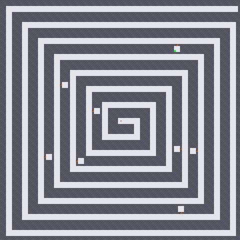 |
| **EpicChase12-150** | `TopoGym/EpicChase12-150-v0` | `[1, 0, 0]` |  |
| **EnlargedChamberCountDoors2-60** | `TopoGym/EnlargedChamberCountDoors2-60-v0` | `[1, 0, 0]` |  |
| **EnlargedChamberCountDoors3-60** | `TopoGym/EnlargedChamberCountDoors3-60-v0` | `[1, 0, 0]` | 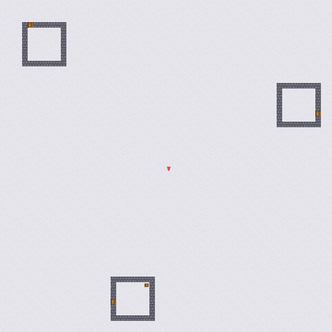 |
| **EnlargedChamberCountDoors4-80** | `TopoGym/EnlargedChamberCountDoors4-80-v0` | `[1, 0, 0]` |  |
| **EnlargedChamberCountDoors5-100** | `TopoGym/EnlargedChamberCountDoors5-100-v0` | `[1, 0, 0]` | 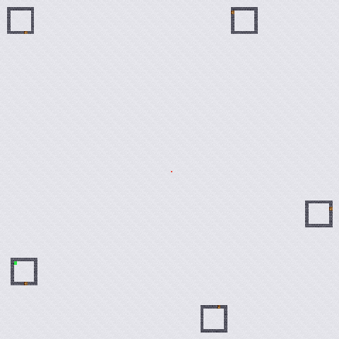 |
| **EnlargedChamberCountDoors6-120** | `TopoGym/EnlargedChamberCountDoors6-120-v0` | `[1, 0, 0]` |  |
| **EnlargedChamberCountDoors8-150** | `TopoGym/EnlargedChamberCountDoors8-150-v0` | `[1, 0, 0]` | 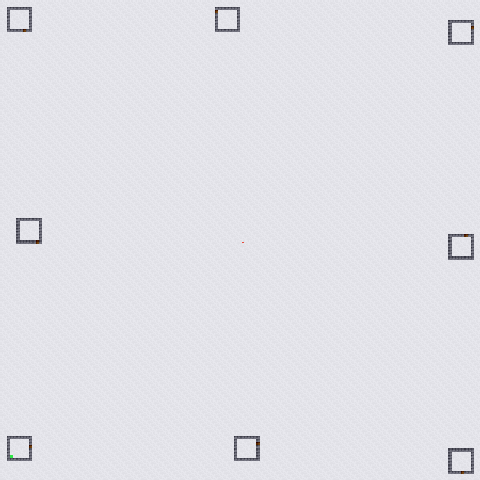 |
| **EnlargedChamberCountDoors10-180** | `TopoGym/EnlargedChamberCountDoors10-180-v0` | `[1, 0, 0]` |  |
| **OpenFieldChamberCountDoors2-480** | `TopoGym/OpenFieldChamberCountDoors2-480-v0` | `[1, 0, 0]` |  |
| **OpenFieldChamberCountDoors3-490** | `TopoGym/OpenFieldChamberCountDoors3-490-v0` | `[1, 0, 0]` | 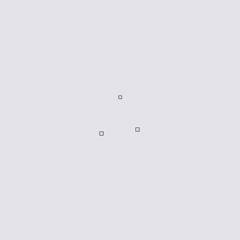 |
| **OpenFieldChamberCountDoors4-500** | `TopoGym/OpenFieldChamberCountDoors4-500-v0` | `[1, 0, 0]` |  |
| **OpenFieldChamberCountDoors5-510** | `TopoGym/OpenFieldChamberCountDoors5-510-v0` | `[1, 0, 0]` | 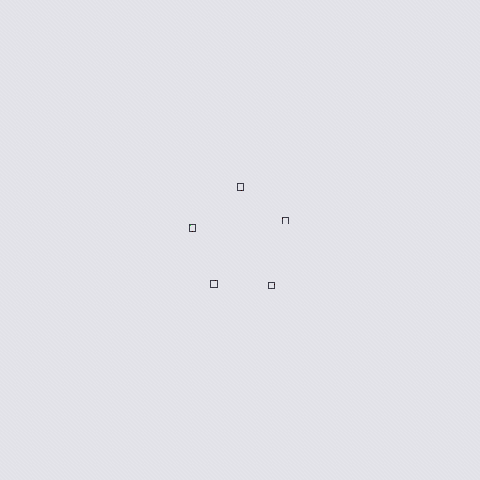 |
| **OpenFieldChamberCountDoors6-530** | `TopoGym/OpenFieldChamberCountDoors6-530-v0` | `[1, 0, 0]` |  |
| **OpenFieldChamberCountDoors8-570** | `TopoGym/OpenFieldChamberCountDoors8-570-v0` | `[1, 0, 0]` |  |
| **OpenFieldChamberCountDoors10-610** | `TopoGym/OpenFieldChamberCountDoors10-610-v0` | `[1, 0, 0]` |  |
| **EpicChaseDoors1-60** | `TopoGym/EpicChaseDoors1-60-v0` | `[1, 0, 0]` | 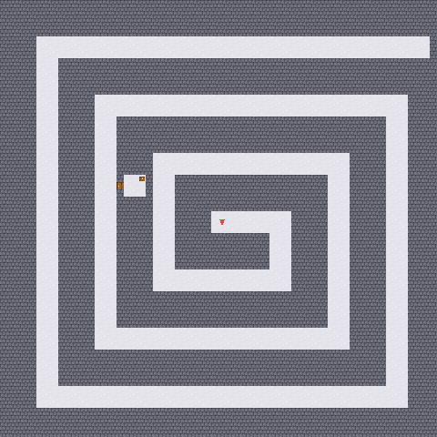 |
| **EpicChaseDoors2-70** | `TopoGym/EpicChaseDoors2-70-v0` | `[1, 0, 0]` | 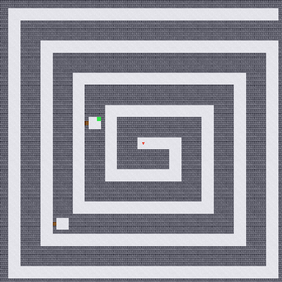 |
| **EpicChaseDoors3-70** | `TopoGym/EpicChaseDoors3-70-v0` | `[1, 0, 0]` | 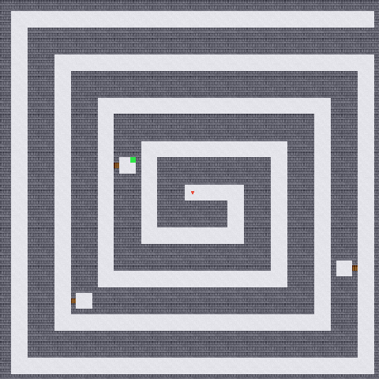 |
| **EpicChaseDoors4-90** | `TopoGym/EpicChaseDoors4-90-v0` | `[1, 0, 0]` |  |
| **EpicChaseDoors6-110** | `TopoGym/EpicChaseDoors6-110-v0` | `[1, 0, 0]` | 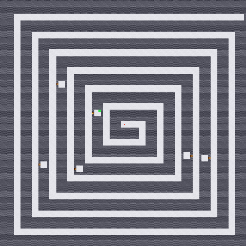 |
| **EpicChaseDoors8-120** | `TopoGym/EpicChaseDoors8-120-v0` | `[1, 0, 0]` |  |
| **EpicChaseDoors12-150** | `TopoGym/EpicChaseDoors12-150-v0` | `[1, 0, 0]` | 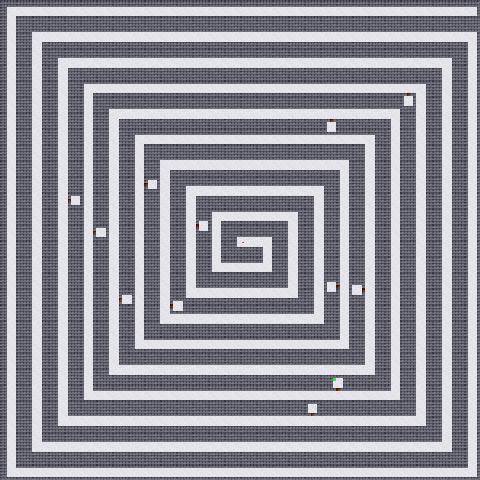 |
| **TopPlane-50** | `TopoGym/TopPlane-50-v0` | `[1, 0, 0]` |  |
| **TopCylinder-50** | `TopoGym/TopCylinder-50-v0` | `[1, 1, 0]` |  |
| **TopMobius-50** | `TopoGym/TopMobius-50-v0` | `[1, 1, 0]` |  |
| **TopTorus-50** | `TopoGym/TopTorus-50-v0` | `[1, 2, 1]` |  |
| **TopKlein-50** | `TopoGym/TopKlein-50-v0` | `[1, 2, 1]` |  |
| **TopRP2-50** | `TopoGym/TopRP2-50-v0` | `[1, 1, 1]` |  |
| **IceShip** | `TopoGym/IceShip-v0` | `[3, 4, 0]` |  |
| **Ladders** | `TopoGym/Ladders-v0` | `[1, 0, 0]` |  |
| **BankRobber** | `TopoGym/BankRobber-v0` | `[1, 0, 0]` |  |
| **DontFall** | `TopoGym/DontFall-v0` | `[1, 0, 0]` |  |
| **SpaceWarp** | `TopoGym/SpaceWarp-v0` | `[2, 1, 0]` |  |
| **ClownChase** | `TopoGym/ClownChase-v0` | `[1, 3, 0]` |  |
| **SearchRescue** | `TopoGym/SearchRescue-v0` | `[1, 160, 0]` |  |
| **EnvironmentalIceShip** | `TopoGym/EnvironmentalIceShip-v0` | `[3, 4, 0]` |  |
