# Environment gallery

Reveal-mode stills (hidden doors purple, decoys dark red);
GIFs show a coverage explorer navigating. Regenerate with
`python scripts/generate_assets.py`.

| env | id | b(Z/2) | view |
|---|---|---|---|
| **Dilution-50** | `TopoGym/Dilution-50-v0` | `[1, 1, 0]` |  |
| **Dilution-200** | `TopoGym/Dilution-200-v0` | `[1, 1, 0]` |  |
| **Chambers2-50** | `TopoGym/Chambers2-50-v0` | `[1, 2, 0]` | 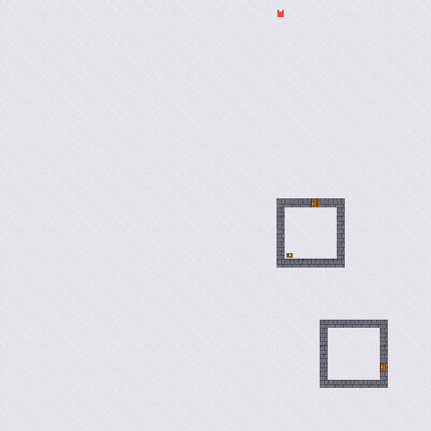 |
| **Chambers2-100** | `TopoGym/Chambers2-100-v0` | `[1, 2, 0]` | 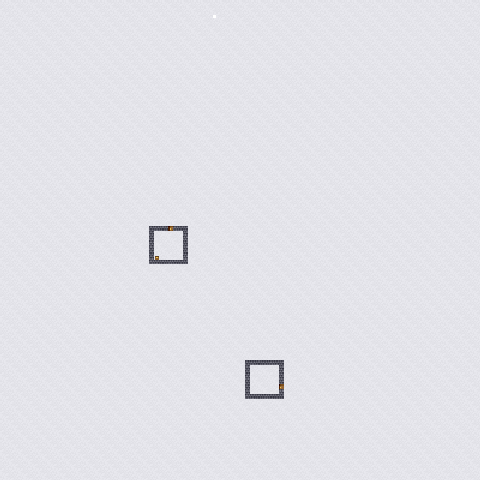 |
| **Chambers2-200** | `TopoGym/Chambers2-200-v0` | `[1, 2, 0]` |  |
| **Chambers2-400** | `TopoGym/Chambers2-400-v0` | `[1, 2, 0]` | 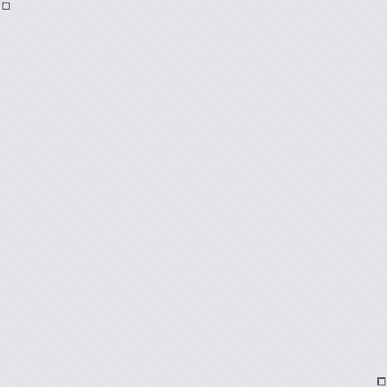 |
| **ChamberCount1-200** | `TopoGym/ChamberCount1-200-v0` | `[1, 1, 0]` | 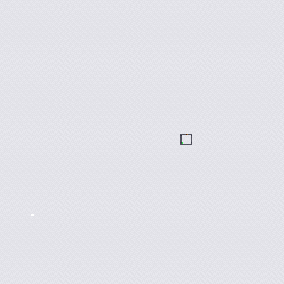 |
| **ChamberCount2-200** | `TopoGym/ChamberCount2-200-v0` | `[1, 2, 0]` |  |
| **ChamberCount4-200** | `TopoGym/ChamberCount4-200-v0` | `[1, 4, 0]` | 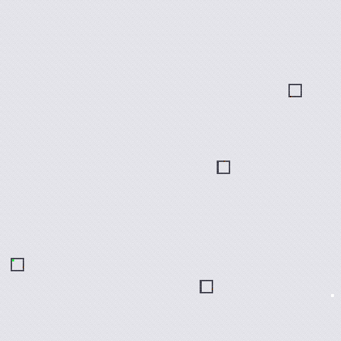 |
| **ChamberCount8-200** | `TopoGym/ChamberCount8-200-v0` | `[1, 8, 0]` | 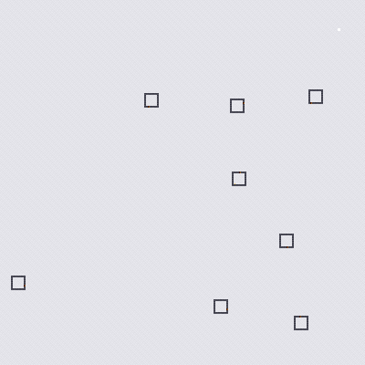 |
| **Decoys0-50** | `TopoGym/Decoys0-50-v0` | `[1, 1, 0]` | 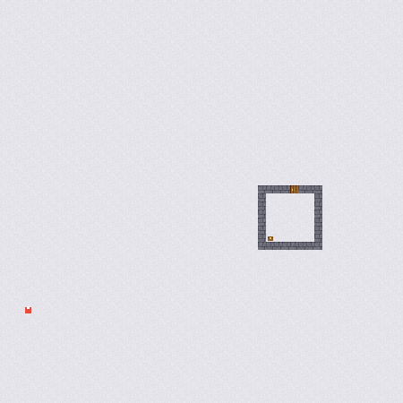 |
| **Decoys1-50** | `TopoGym/Decoys1-50-v0` | `[1, 2, 0]` | 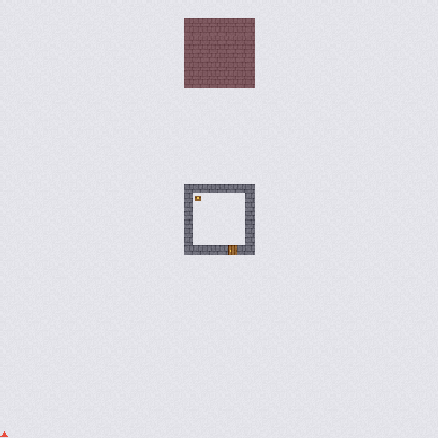 |
| **Decoys2-50** | `TopoGym/Decoys2-50-v0` | `[1, 3, 0]` | 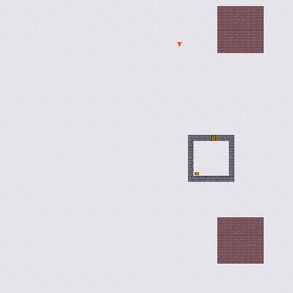 |
| **Decoys4-50** | `TopoGym/Decoys4-50-v0` | `[1, 5, 0]` | 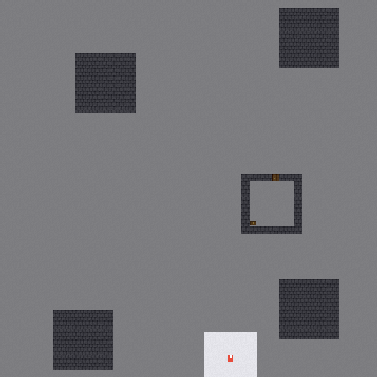 |
| **Decoys8-50** | `TopoGym/Decoys8-50-v0` | `[1, 9, 0]` | 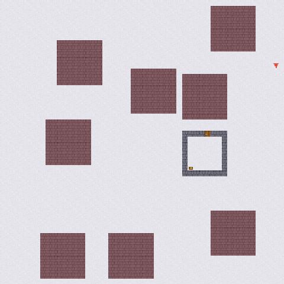 |
| **ShapeSq-50** | `TopoGym/ShapeSq-50-v0` | `[1, 1, 0]` |  |
| **ShapeCi-50** | `TopoGym/ShapeCi-50-v0` | `[1, 1, 0]` | 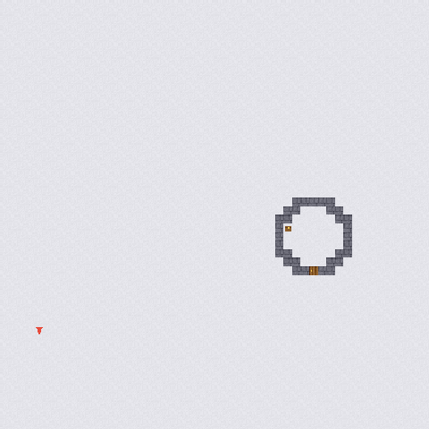 |
| **ShapeTr-50** | `TopoGym/ShapeTr-50-v0` | `[1, 1, 0]` | 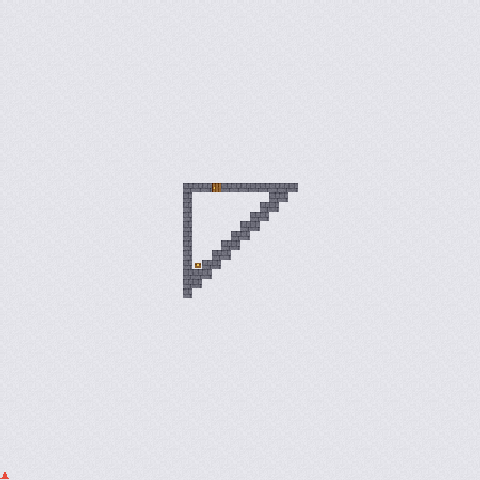 |
| **ShapeSt-50** | `TopoGym/ShapeSt-50-v0` | `[1, 1, 0]` | 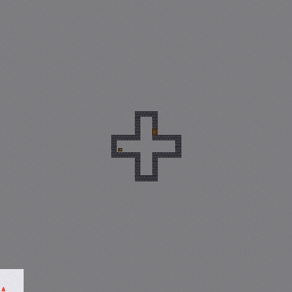 |
| **Nested1-50** | `TopoGym/Nested1-50-v0` | `[1, 2, 0]` | 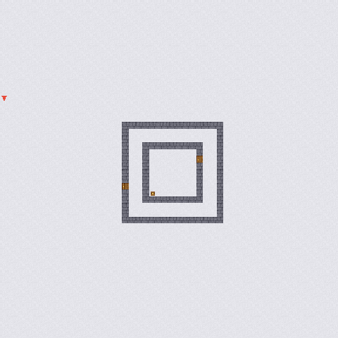 |
| **Nested2-50** | `TopoGym/Nested2-50-v0` | `[1, 3, 0]` | 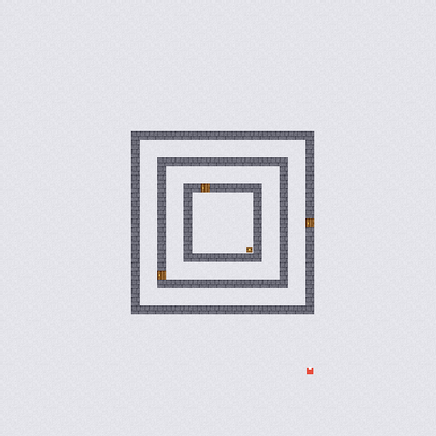 |
| **Nested3-50** | `TopoGym/Nested3-50-v0` | `[1, 4, 0]` |  |
| **GiveUp1-50** | `TopoGym/GiveUp1-50-v0` | `[1, 1, 0]` | 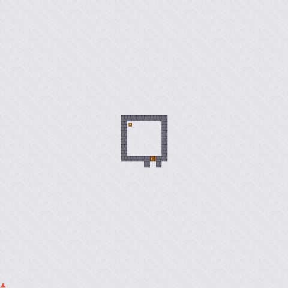 |
| **GiveUp2-50** | `TopoGym/GiveUp2-50-v0` | `[1, 1, 0]` | 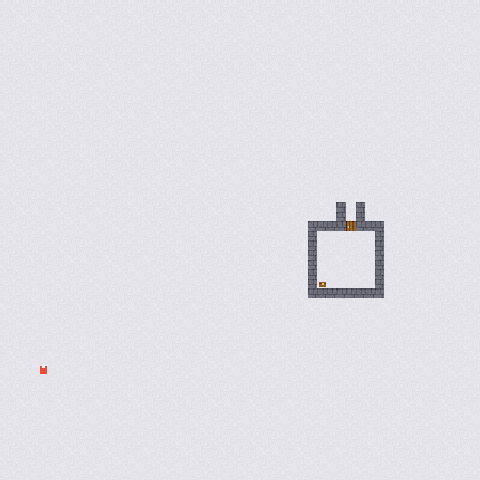 |
| **GiveUp4-50** | `TopoGym/GiveUp4-50-v0` | `[1, 1, 0]` | 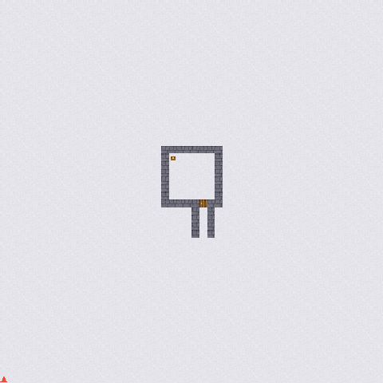 |
| **Bottleneck3-100** | `TopoGym/Bottleneck3-100-v0` | `[1, 0, 0]` | 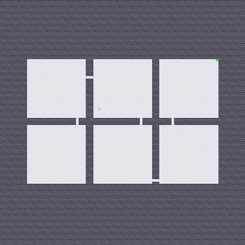 |
| **Bottleneck6-100** | `TopoGym/Bottleneck6-100-v0` | `[1, 0, 0]` | 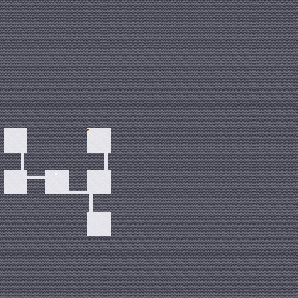 |
| **Maze-50** | `TopoGym/Maze-50-v0` | `[1, 0, 0]` | 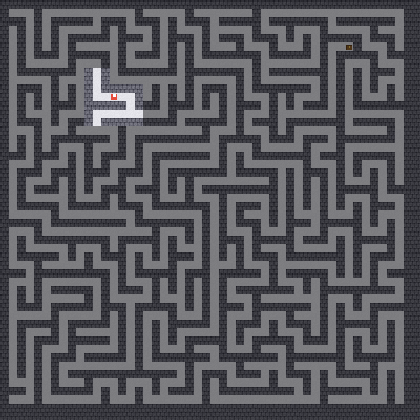 |
| **Maze-100** | `TopoGym/Maze-100-v0` | `[1, 0, 0]` | 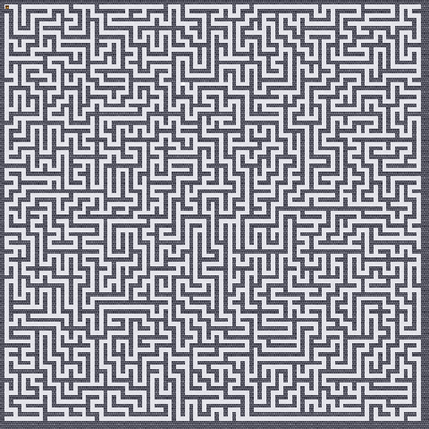 |
| **TopPlane-50** | `TopoGym/TopPlane-50-v0` | `[1, 4, 0]` | 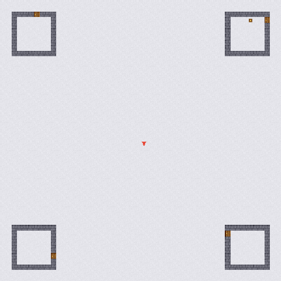 |
| **TopCylinder-50** | `TopoGym/TopCylinder-50-v0` | `[1, 5, 0]` | 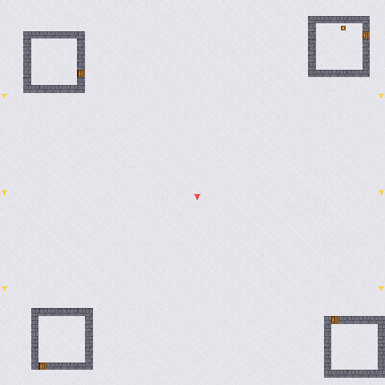 |
| **TopMobius-50** | `TopoGym/TopMobius-50-v0` | `[1, 5, 0]` | 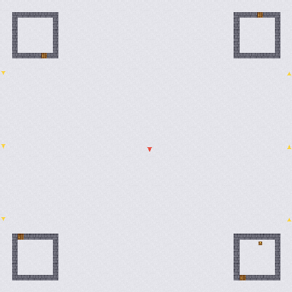 |
| **TopTorus-50** | `TopoGym/TopTorus-50-v0` | `[1, 5, 0]` |  |
| **TopKlein-50** | `TopoGym/TopKlein-50-v0` | `[1, 5, 0]` | 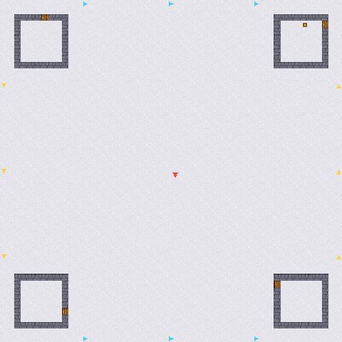 |
| **TopRP2-50** | `TopoGym/TopRP2-50-v0` | `[1, 4, 0]` | 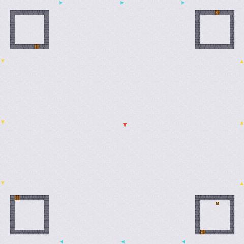 |
| **IceShip** | `TopoGym/IceShip-v0` | `[3, 4, 0]` | 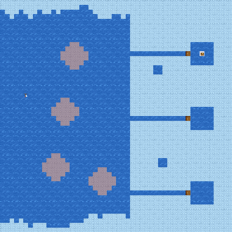 |
| **Ladders** | `TopoGym/Ladders-v0` | `[1, 0, 0]` |  |
| **BankRobber** | `TopoGym/BankRobber-v0` | `[1, 4, 0]` |  |
| **DontFall** | `TopoGym/DontFall-v0` | `[1, 12, 0]` |  |
| **SpaceWarp** | `TopoGym/SpaceWarp-v0` | `[2, 4, 0]` |  |
| **ClownChase** | `TopoGym/ClownChase-v0` | `[1, 4, 0]` |  |
| **SearchRescue** | `TopoGym/SearchRescue-v0` | `[1, 161, 0]` |  |
| **EnvironmentalIceShip** | `TopoGym/EnvironmentalIceShip-v0` | `[3, 4, 0]` |  |
